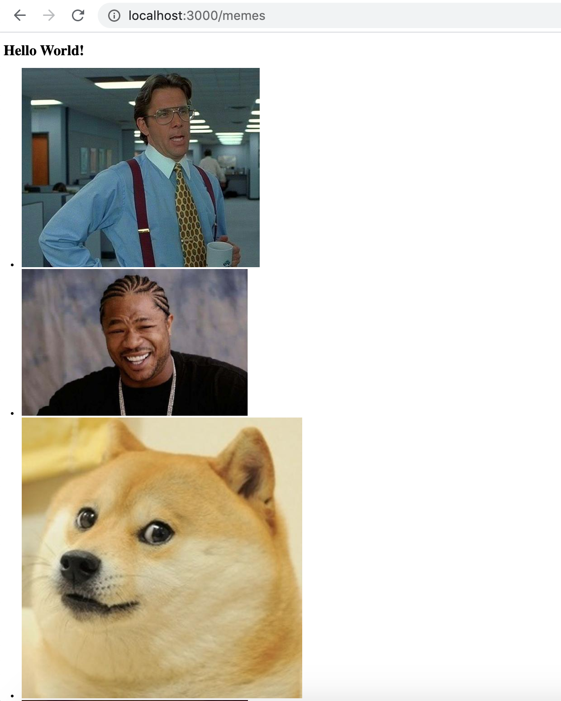

# A Primer On Embedded JavaScript

[Embedded JavaScript](https://ejs.co/#install) (EJS) is a templating language that is used to embedd JavaScript into HTML. EJS files are saved in a .ejs extension format. EJS is popular because it looks familiar to web developers and provides an easy way to render data to the client side.

In this short tutorial, we will go over the following:
<ul>
<li>Installing and Setting Up EJS</li>
<li>Rendering Data to an EJS File</li>
<li>Handling Data in EJS</li>
</ul>

#### Step 1: Installing and Setting Up EJS


```javascript
app.js
------

module.exports = () {
    const express = require('express')
    const app = express()

    app.set('view engine', 'ejs')

    //app.get('/', (req, res) => res.send('Hello World!'))
    app.use(express.static('public'))

    return app
}()
```


#### Step 2: Rendering the Result to the /memes Endpoint

Now that we have our results in our express app, we just need to render it so the client can see it. To do this, we can simply use embedded JavaScript (EJS) like so:

```javascript
    let result = await memes.getMemes()

    response.render('memes', {
        title: 'Memes, Memes, Memes!',
        listOfMemes: result 
    })
```

Now that we have our application wrapped in an app.get() we can create a memes.ejs file to push render to. For now, let's just create a basic ejs file called memes.ejs in our views folder. This file doesn't have to contain anything other than HTML5's boiler plate code for now.

After that is done, we can call response.render() which takes the name of the ejs file (in thise case memes.ejs) and an object where we map our result to a variable that is passed to our ejs file for handling.

At this point, our app.js file should look like this:

```javascript
    module.exports = function (database) {
        const express = require('express')
        const memes = require('./memes')
        const app = express()

        app.set('view engine', 'ejs')
        
        app.get(('/'), (request, response) => {
            response.send('<h1>Hello World!</h1>')
        })

        app.get(('/memes'), async (request, response) => {
            let result = await memes.getMemes()

                response.render('memes', {
                title: 'Memes, Memes, Memes!',
                listOfMemes: result 
            })
        })
        
        return app;
    }(null);
```

#### Step 8: Handling the Memes in the EJS File

Once we have access to the result in the form of a variable called 'listOfMemes', we can simply loop through our array of meme objects and create HTML tags to be displayed. In this case, I have chosen to wrap the meme objects in a list tag.

```html
<!DOCTYPE html>
<html lang="en">
<head>
    <meta charset="UTF-8">
    <meta name="viewport" content="width=device-width, initial-scale=1.0">
    <title>Document</title>
</head>
<body>
    
    <h1>Hello World!</h1>
    <ul>
        <% listOfMemes.forEach(function(item, index){ %>
            <li> " alt="some meme" </li>
        <% }); %>
    </ul>

</body>
</html>
```

And at last, we can take a look at our finished product by starting up our node express server and then using our browser to access our localhost, in my case, this is http://localhost:3000/memes.

The page should look something like this:


It could certainly use a bit of styling, but we'll leave that for another time.


Congratulations!!! You are now one step closer to becoming a web developer.

In the next section, we will be talking about integrating a method to handle our errors centrally.
