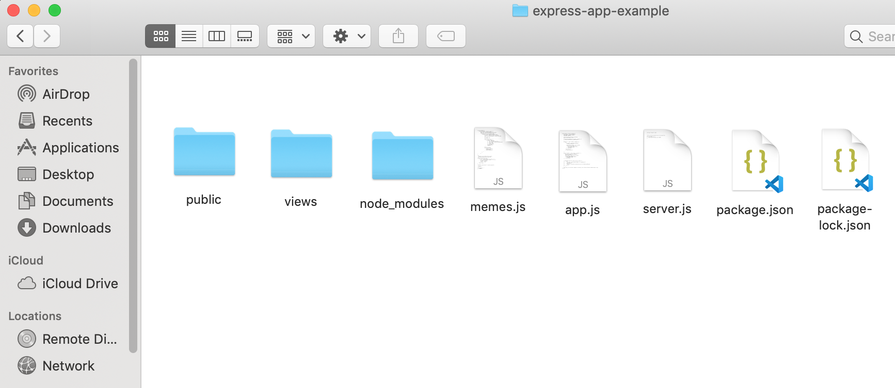
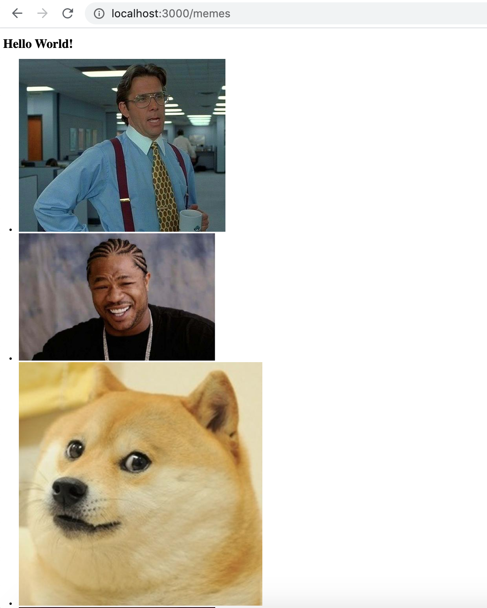

# A Primer On Embedded JavaScript

[Embedded JavaScript](https://ejs.co/#install) (EJS) is a templating language that is used to embedd JavaScript into HTML. EJS files are saved in a .ejs extension format. EJS is popular because it looks familiar to web developers and provides an easy way to render data to the client side.

In this short tutorial, we will go over the following:
<ul>
<li>Installing and Setting Up EJS</li>
<li>Rendering Data to an EJS File</li>
<li>Creating an EJS File and Handling Data</li>
</ul>

## Installing and Setting Up EJS

The first thing to do before we get started of course, is to install and setup EJS, so let's do that.

#### Step 1: NPM Install EJS

As you can imagine by now, all we need to do to install Embedded JavaScript is to install it via the terminal like so:

```bash
$ npm install ejs
```

#### Step 2: Instruct Express.js to Use EJS as a View Engine

To serve EJS content through Express, we need to tell Express to use EJS. To do this, we actually need to tell Express to use EJS at the application level. We do this with the express application property .set() like so:

```javascript
    app.set('view engine', 'ejs')
```

Think of the .set() method as a way to access and modify the configuration of your express application.

With regards to where we place this code, we should put this after we've decleared our application, and before any end points like so:

```javascript
app.js
------

module.exports = () {
    const express = require('express')
    const app = express()

    app.set('view engine', 'ejs')

    //app.get('/', (req, res) => res.send('Hello World!'))
    app.use(express.static('public'))

    return app
}()
```

Finally, we can move onto the last step, which is to setup a folder to put our EJS files in.

#### Step 3: Creating a Views Folder In Your Root Directory

We will need to create a folder called 'Views' inside our root directory and it will need to be called Views. This is a special folder that is used for the purpose of putting in templating language files. By default, the path is directly within the root directory, so let's do that like so:



This views folder is where we will be putting in all of our .ejs files.

Now, we are ready to move on to rendering data.


## Rendering Data to the EJS File

To recap, so far we have created a memes.js file that gets an array of meme objects, and we can get that array of meme objects through a .get('/memes') end point. Now, we are finally ready to take those meme objects and render them to HTML so that we can serve to our end users.

#### Step 1: Calling response.render() to Render a View

The Express response object has a method called .render() that is used to render a view. For this tutorial, all you need to know is that an .ejs file is a kind of view file (there are many others).

Returning to our app.js file, let's call res.render() like so:

```javascript
app.js
------

app.get(('/memes'), async (req, res) => {

    let result = await memes.getMemes()
    //console.log(result)
    res.render('', {

    })
})
    
```

#### Step 2: Pass in Data as Key Value Pairs 

If you take a look at your code editor, you will notice that .render() will take two arguments, the first is for a 'view' which should be a string, and the second, an object. The somewhat mysterious 'view' argument is simply the name of the .ejs file in your views folder. We don't have one yet, but let's pass in 'memes' for now like so:

```javascript
app.js
------

app.get(('/memes'), async (req, res) => {

    let result = await memes.getMemes()
    //console.log(result)
    res.render('memes', {

    })
})
    
```

The second argument, the object, is something we can use to pass in key value pairs. The key will be a variable name, and the value will be any value we want to pass to the view file. Let's pass in a title along with our result from calling .getMemes() like so:

```javascript
app.js
------

app.get(('/memes'), async (req, res) => {

    let result = await memes.getMemes()
    //console.log(result)
    res.render('memes', {
        title: 'Memes, Memes, Memes!',
        listOfMemes: result 
    })
})
    
```

Putting everything together, our app.js file should look like this:

```javascript
app.js
------

module.exports = () {
    const express = require('express')
    const app = express()
    const memes = require('./memes')

    //app.get('/', (req, res) => res.send('Hello World!'))
    app.use(express.static('public'))

    app.get(('/memes'), async (req, res) => {

        let result = await memes.getMemes()

        res.render('memes', {
            title: 'Memes, Memes, Memes!',
            listOfMemes: result 
        })
    })

    return app
}()
```

That looks pretty good for now, let's move on to creating our EJS view file.

## Creating an EJS File and Handling Data

So we've told Express that .render() should be expecting a 'memes' view file, but we haven't created one yet, so let's do that now. 

#### Step 1: Create an EJS Views File

Simply create a file called memes.ejs inside your views folder that you just created in your root directory. This file doesn't have to contain anything other than HTML5's boiler plate code like so:

```HTML
<!DOCTYPE html>
<html lang="en">
<head>
    <meta charset="UTF-8">
    <meta name="viewport" content="width=device-width, initial-scale=1.0">
    <title>Document</title>
</head>
<body>

</body>
</html>

```

So far, there is nothing special about this file, even though it uses an .ejs extension, this is for all intents and purposes the same as a .html file.

#### Step 2: Using JavaScript and the Keys from res.render()

We created two variables and passed them to the .render() method via an anonymous object in our app.js file. Now, we want to pull them out and use them in our .ejs file. We can do that very simply by using EJS's signature angle bracket and percentage sign notation like so:

```html
<!DOCTYPE html>
<html lang="en">
<head>
    <meta charset="UTF-8">
    <meta name="viewport" content="width=device-width, initial-scale=1.0">
    <title><%= title %></title>
</head>
<body>
    
    <h1>Hello World!</h1>
    <ul>
        <% listOfMemes.forEach(function(item, index){ %>
            <li> " alt="some meme" </li>
        <% }); %>
    </ul>

</body>
</html>
```

Essentially, for any JavaScript lines, we can type them as usual and simply enclose them with <% %> on each side. To use a variable that we passed in, we simply need to add an equal sign to the right of the leading <%.

And Voila! Just like that, we've created the view file necessary to render our array of meme objects. Let's take a look at our hardwork by starting up our node express server and typing in the url of end point, and in this case, http://localhost:3000/memes.

The page should look something like this:


It could certainly use a bit of styling, but we'll leave that for another time. For now, let's celebrate how far you've gotten!


Congratulations!!! You are now one step closer to becoming a web developer.

In the next section, we will be talking about [error handling](./error-handling.md).
