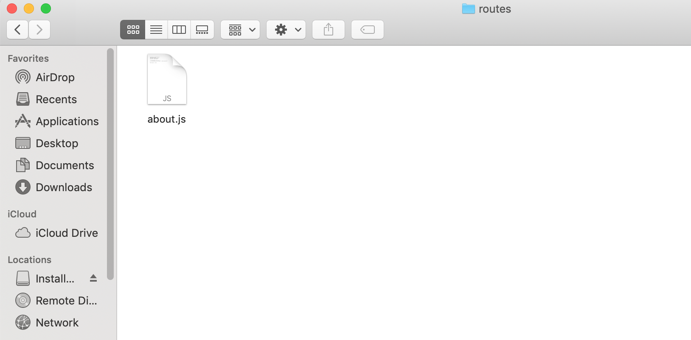
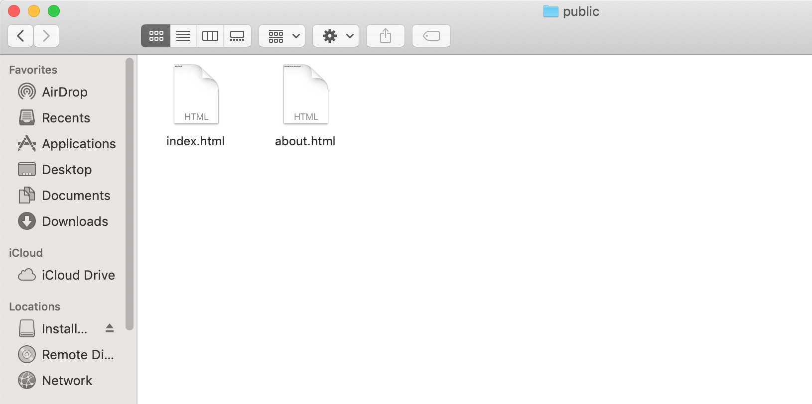
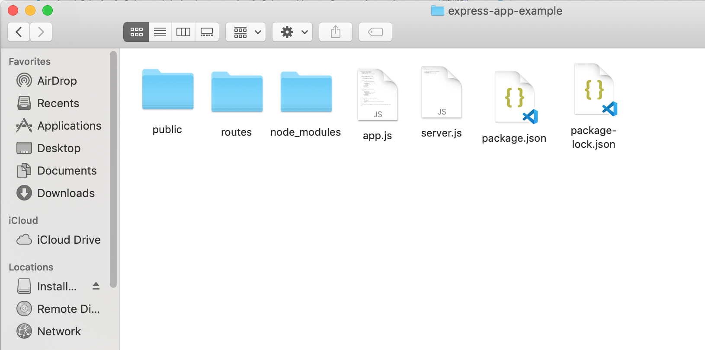
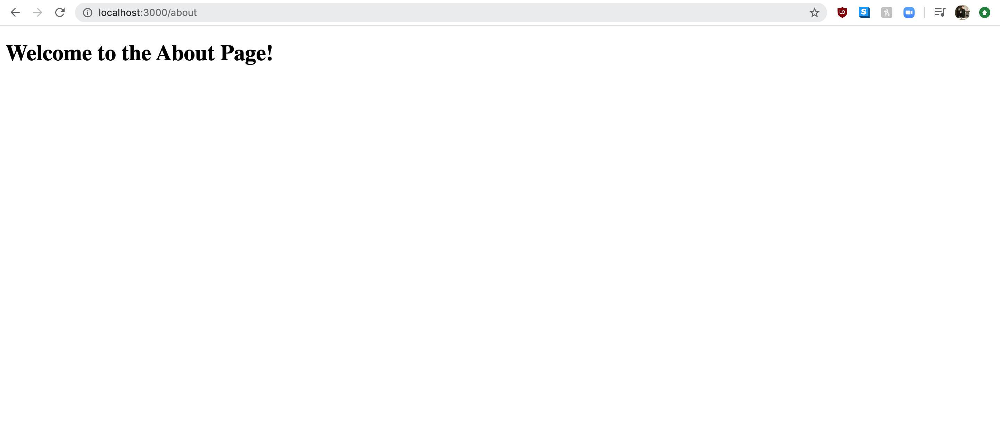

# Using Express Routers for Better Modularity

In this tutorial we will be going over how to use Express router property to break routes down into their own files. Again, the purpose of increasing modularity is to make our code easier to read, debug, work with, and test. It is essential that we modularize our code.

Here, we break down this process into four short steps:
<ul>
<li>Create a Routes Folder</li>
<li>Calling the Express Router Function in our Route Files</li>
<li>Using router.get() Instead of app.get()</li>
<li>Requiring Our Route Files and Using Them in app.js.</li>
</ul>

## Create a Routes Folder

Let's create a new folder to house all of our routes. We will do this directly within our project's root directory, and for now, let's just call it **routes**. This folder will hold the various files that will handle all the different routes and endpoints for our application. By having all of our routes in one place, but not in one file, we can keep our Express server organized.

For this example, lets one file in our routes folder called **about.js** like so:



We will get this about.js file to handle the end points to all the urls belonging to the /about route.

In this case, this about.js file will direct all requests for urls including '/about/' to an about.html page in the 'public' folder which is a sub-folder directly under the root directory like this:



We will still leave our app.js and server.js file directly in the root directory. In other words, our express server is organized like this:



And the code looks like this right now:

root directory:
```javascript
app.js
------

module.exports = () {
    const express = require('express')
    const app = express()

    app.use(express.static('public')) //hosting a file called index.html

    return app
}()


server.js
---------

const port = 3000

app.listen(port, () => console.log(`Example app listening on port ${port}!`))
```


routes sub-directory:
```javascript
about.js
--------
const express = require('express')
```

## Calling the Express Router Function in our Route Files

Let's start in our about.js file. Like any express app, the first line of code would be to require express. After that, we will need to get access to the express.router function. Like the express application object, we can get access to the router by simply binding it to a global variable. Let's do that now by binding it to a variable called router like so:

```javascript
about.js
--------

const express = require('express')
const router = express.Router();

```

>Note: the name of the global variable to bind express.Router() is **router** by convention.

At this time, let's also require the Node.js built-in '[path](https://nodejs.org/api/path.html)' module. If you aren't already familiar, this module will let us reference the relative and absolute paths of our files and directories more easily. Again, all we need to do is bind it to a variable like so:

```javascript
about.js
--------

const express = require('express')
const router = express.Router();
const path = require('path')
```

## Using router.get() Instead of app.get()

Essentially you can think of router.get() as an app.get() with the additional functionality to fork out end points. We refer to a fork of end points as a route. If that doesn't make sense right now, that's okay, as it will make more sense after we create a route.

To use router.get(), all we need to do is call it just like app.get() like so:

```javascript
router.get('', (req, res) => {
    
});
```

Again, we can see that router.get() takes two arguments, the first of which is a string that refers to a path, and the second a callback function that takes a request, a response, and optionally, a 'next' argument. We will leave that one out for now.

Let's pass in ```'/about'``` for the path, and then in the body of the anonymous function, call ```res.sendFile()``` and pass in our about.html page like so:

```javascript
router.get('/about', (req, res) => {
    res.sendFile(path.join(__dirname, '../public/about.html'))
});
```

As you can imagine, this property will send a whole file to the end user.

>Note: res.sendFile() requires an absolute path or a reference to the root directory. This is we use the built-in path module as shown.

At this point, our about.js file should look like this:

```javascript
about.js
--------

const express = require('express');
const router = express.Router();
const path = require('path');


router.get('/about', (req, res) => {
    res.sendFile(path.join(__dirname, '../public/about.html'))
});
```

To make this file available to our main app.js file, we will need to export the Express router. We accomplish this by simply using module.exports and exporting the router directly like so:

```javascript
about.js
--------

const express = require('express');
const router = express.Router();
const path = require('path');


router.get('/about', (req, res) => {
    res.sendFile(path.join(__dirname, '../public/about.html'))
});

module.exports = router
```

Now, we are ready to move back to our app.js file and require this about.js file.

## Requiring Our Route Files and Using Them in app.js

In order to use our route files, we need to require them in our app.js. We do that by simply requiring them like normal as follows:

```javascript
app.js
------

module.exports = () {
    const express = require('express')
    const app = express()

    const aboutRouter = require('./routes/about')

    app.use(express.static('public')) //hosting a file called index.html


    return app
}()
```

>Note: By convention we name the variables that require the routes by the route name and then router. In this case, we are requiring the about router, and name it accordingly.

Now that the route is required, all we need to do is to tell Express to use the route. Similar to the express.static function, we just call ```app.use()``` and pass in ```aboutRouter``` like so:

```javascript
app.js
------

module.exports = () {
    const express = require('express')
    const app = express()

    const aboutRouter = require('./routes/about')

    app.use(express.static('public')) //hosting a file called index.html

    app.use(aboutRouter)


    return app
}()
```

And that's it! Let's test our hardwork by running the server and accessing 'localhost:3000/about'.



Voila!

## Summary

At this point we have created routes to even further modularize our code, and all we had to do was to write a few additional lines of code. Very little effort for the enormous benefit of writing code that is easy to read, work with, debug, and test.