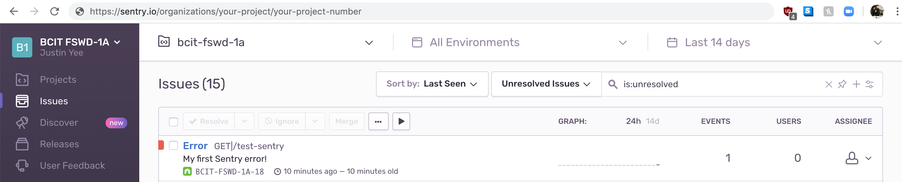

# Centralized Error Handling with Sentry.io

Centralized error handling is a very important concept in development. When your application gets to production, it is critical that you are alerted to errors in a timely manner, so that you can address them as needed. This tutorial will introduce one way to do that.

[Sentry.io](https://sentry.io/for/javascript/) is a third party web platform that centralizes the task of tracking your errors. Easily implemented with a few lines of code in Express.js and free to use for small applications, it is a popular choice among developers.

## Prerequisite

You will need to sign up with sentry.io first, before proceeding with the following tutorial, and you can do that [here](https://sentry.io/signup/).

## Section 1: Installing Sentry For Express.js

As you can guess by now, move to your root directory and npm install Sentry for Node.js with the following command:

```bash
npm install @sentry/node
```

## Section 2: Requiring Sentry in our app.js File

Once we have sentry installed in our project, we can require the module into our app.js file. We should do this at the top of the file like so:

```javascript
app.js
------

module.exports = () {
    const express = require('express')
    const app = express()
    const sentry = require('@sentry/node');

    app.use(express.static('public')) //hosting a file called index.html

    return app
}()
```

## Section 3: Instructing Express to Use Sentry

To tell Express.js to use Sentry for our error handling, we need to do two things: we must initialize sentry with ```Sentry.init()``` and we must call the ```.use()``` function on our Express application.

#### Part 1: Initializing Sentry

```Sentry.init()``` is a function of the Sentry object. All we need to really do is to pass in a data source name (DSN), which is essentially a URL to a database. The DSN will be composed of your hash key and your account number that you got after signing up with Sentry.io.

```javascript
Sentry.init({
	dsn: 'https://<YOUR_HASH_KEY>@sentry.io/<YOUR_ACCOUNT>',
});
```

#### Part 2: Calling app.use() to Inform Express

Next, we want to call app.use() so that Express.js is aware of the Sentry object. We will need to pass in a specific property of the Sentry object called ```.Handlers.requestHandler()``` like so:

```javascript
app.use(Sentry.Handlers.requestHandler());
```

And at this point, our app.js file should now look like this:

```javascript
app.js
------

module.exports = () {
    const express = require('express')
    const app = express()
    const sentry = require('@sentry/node');

    Sentry.init({
        dsn: 'https://<YOUR_HASH_KEY>@sentry.io/<YOUR_ACCOUNT>',
    });

    app.use(Sentry.Handlers.requestHandler());

    app.use(express.static('public')) //hosting a file called index.html

    return app
}()
```

>Note: Ensure that ```app.use(Sentry.Handlers.requestHandler())``` is called after ```Sentry.init()``` and before any other middlewares are called.

#### Part 3: Calling app.use() again, for the Error Handling

Finally, we need to call ```app.use()``` one more time and pass in another Sentry property. This time, put it at the bottom of the file, right before ```return app``` like so:

```javascript
app.js
------

module.exports = () {
    const express = require('express')
    const app = express()
    const sentry = require('@sentry/node');

    Sentry.init({
        dsn: 'https://<YOUR_HASH_KEY>@sentry.io/<YOUR_ACCOUNT>',
    });

    app.use(Sentry.Handlers.requestHandler());

    app.use(express.static('public')) //hosting a file called index.html

    app.use(Sentry.Handlers.errorHandler());

    return app
}()
```

And now, we have Sentry configured and ready to be used.

## Section 4: Configuring Your End Point to Use Sentry

Let's create a new ```app.get()``` end point called 'test-sentry'. To test that our setup is working, all we need to do is to throw an error like so:

```javascript
app.js
------

module.exports = () {
    const express = require('express')
    const app = express()
    const sentry = require('@sentry/node');

    Sentry.init({
        dsn: 'https://<YOUR_HASH_KEY>@sentry.io/<YOUR_ACCOUNT>',
    });

    app.use(Sentry.Handlers.requestHandler());

    //routes go here
    app.get('/test-sentry', () => {
    throw new Error("My first Sentry Error!")
    })

    app.use(express.static('public'))


    //routes end here
    app.use(Sentry.Handlers.errorHandler());

    return app
}()
```

Now, let's access this end point by starting up the server and accessing 'localhost:3000/test-sentry', and then going to your Sentry dashboard. You should see your error pop up like so:



Just like magic, every error that you throw in your app.js file will now get sent to your Sentry dashboard!


## Conclusion

In our final tutorial you have learned one way to integrate centralized error handling into your server. I can't stress enough how important it is to have clean code, modular code, and to have a centralized method of error handling. Putting efforts into doing these things will make you a better developer, and a more valuable one.
