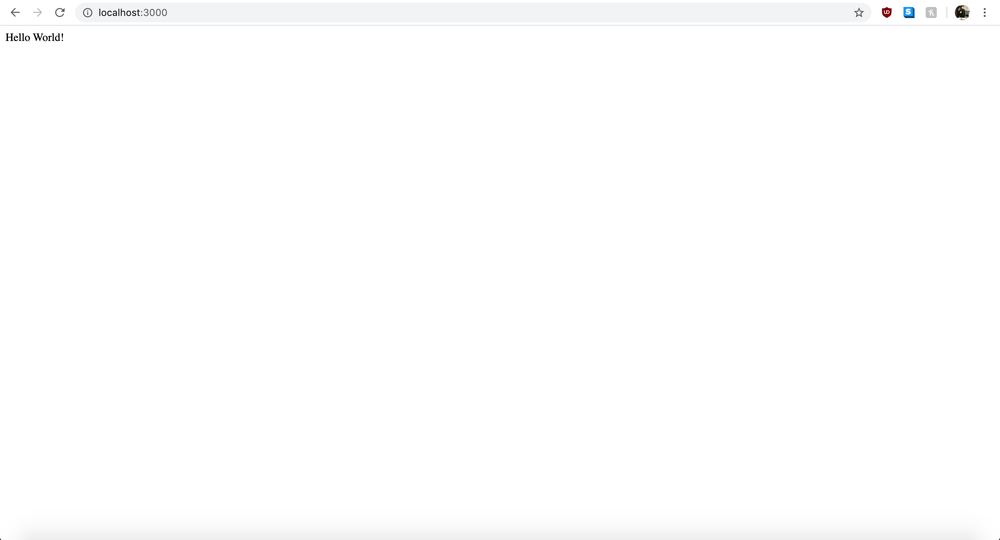

# Creating Your First Express Server

These instructions will go over how to setup a the most basic web server using Express.js and then introduce additional components to make your server more useful and scalable.

## Setting Up Your Server's Root Directory

Express.js is a framework for Node.js. If you do not have Node.js installed, please download it here at [nodejs.org](https://nodejs.org/en/download/).

#### 1. Create Your Root Directory

Once you have Node.js installed, create a new file directory for your server/project. You can do this with your explorer (Windows) or finder (MacOS), your favorite code editory, or with your terminal. We encourage that you get used to typing in comands with your terminal, and can do so with the following commands:


For now, we will simply create the server directly inside this root folder, so this will be the only file we need to create right now.

#### 2. Intialize npm

The next few steps will require the use of the terminal. In your terminal, type the command **npm init** and press enter like so:


Running npm init prompts various questions regarding your project. For now, you can skip these questions by pressing enter.

The npm init command, creates a file called package.json which at its core, is a configuration file for your project. We will not go over why you should be doing this in this tutorial. If you would like to look into this however, we encourage you to look into the official documdntation by [npmjs](https://docs.npmjs.com/creating-a-package-json-file).

#### 3. Installing Express.js

Now, we are ready to install our server software, Express.js. We can do this again, by typing a command into the terminal like so:


>Note: If you are also referencing older resources, they may be instructing you to also type the --save option after typing express. As of [npm 5.0.0](https://blog.npmjs.org/post/161081169345/v500), all installations are saved as a dependency in your package.json by default.

Finally, at this point, we are ready to create our first web server using Express.js.

## Hosting Our First Web Server with Express.js

Now that we have everything ready, we can create our first web server with just a few lines of code.

#### 1. Creating Our Server File and Requiring Express

If you aren't already aware, this may seem incredible, but all we need to do to create a web server is to create a simple JavaScript file! Express will do everything else to bring your server to life.

You can create your JavaScript file with your terminal or a code editor like [vscode](https://code.visualstudio.com/).

After your file is created, let's require/import the express library that we just downloaded with the following line of code:

```javascript
const express = require('express')
```

After we have required the express library, we can get access to all of its functions by creating an express() object by calling it and binding it to a variable like so:

```javascript
const app = express()
```

You can call your variable something else, but it is convention to name an express object as 'app'.

Putting the two lines together, your file should look like this:

```javascript
const express = require('express')
const app = express()
```

The express object has so very many functions and properties that we will not be able to go over even one tenth of them in this tutorial. If you are curious, however, we encourage you to look at [express.js' official documentation](https://expressjs.com/en/api.html).

For now, let's define a basic endpoint for our express application that simply returns the words *"Hello World"* to any client that accesses that endpoint.

#### 2. Creating Our First Express Endpoint

We can create a  by calling the .get() property on our express object. If you take a look at your code editor, you will notice that it the .get() property takes two arguments, a string that corresponds to a url path and a callback function that itself takes two arguments for request and response.

Let's pass in '/' which simply refers to the index page, and an anonymous function with two parameters:

```javascript
app.get('/', (req, res) => {
    
})
```

>Note: It is convention to use 'req' as the abbreviation for request and 'res' as the abbreviation for response. You can change them to any two words, but the first word will always refer to request and the second will always refer to response.

The body of the callback function will be called automatically every time a user accesses the index page endpoint. For now, we can simply test that the .get() property is working as intended by logging "hello world" to the console like this:

```javascript
app.get('/', (req, res) => {
    console.log("Hello World!")
})
```

And, at this point, our file should look like this:
```javascript
const express = require('express')
const app = express()

app.get('/', (req, res) => {
    console.log("Hello World!")
})
```

Now, if you try to run this code, it won't work just yet. This is because we still need to call one more express object property called .listen() to actually host the index page endpoint.

#### 3. Hosting Our First Endpoint

If you call the .listen() property, you will notice that it also takes one argument for a port number, and an optional callback function that is called after the application is hosted. For now, let's pass in the integer 3000 for the port number and an anonymous callback function that simply logs out a message like so:

```javascript
app.listen(3000, () => {
    console.log(`Express app hosted on port 3000!`)
})
```

Now, we can finally test our endpoint by typing node app.js into our terminal like so:

```bash
$ node app.js
```

And typing 'http://localhost:3000/' into our browser.

You will notice that your browser just hangs and doesn't display anything, but that's perfectly fine because all we have done is log out a pair of messages. Checking our console, we can see the following:

```javascript
'Express app hosted on port 3000!'
'Hello World!'
```

At this point, we have created our first end point, and hosted it to a port. Next, let's send a response back to our user.

#### 4. Sending an HTTP Response to the User

So far, our code should now look like this:

```javascript
const express = require('express')
const app = express()

app.get('/', (req, res) => {
    console.log("Hello World!")
})

app.listen(3000, () => {
    console.log(`Express app hosted on port 3000!`)
})
```

Now let's replace the console.log with a response to the user. We can do this by calling the .send() property on the response argument.

```javascript
app.get('/', (req, res) => {
    res.send()
})
```

If you are following along in your code editor, you can see that it is expecting something to be passed into a 'body'. This body refers to the response object's body, and is the code that will get rendered to the browser. For now, let's pass in "Hello World!" like so:

```javascript
app.get('/', (req, res) => {
    res.send("Hello World!")
})
```

And finally, combining everything together, it should look like this:

```javascript
const express = require('express')
const app = express()

app.get('/', (req, res) => {
    res.send("Hello World!")
})

app.listen(3000, () => {
    console.log(`Express app hosted on port 3000!`)
})
```

Let's try re-running our server and accessing our local host again. Your browser should now render the following:



Congratulations! Now, we've setup a Express.js server and hosted our first end point. Now, we can really start to get into writing more code to make our web server more useful. Next up is to do a bit of code refactoring to make our server more useful by [refactoring it](./refactor.md).