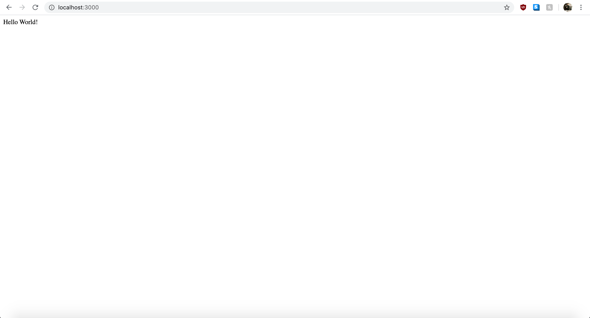

# Refactoring the Code to Increase Modularity

There are a few things that can be done to make the code more modular and easier to work with. Even if you are working alone, creating modular code will make your work easier to read and debug.

In this section, we will go over the following:
<ul>
<li>Removing Magic Numbers</li>
<li>Moving the Hosting Functionality to Another File</li>
<li>Moving Express Apps into Sub-Folders.</li>
</ul>

#### Removing Magic Numbers From Your Code

Our code so far is only eight lines, but even then, we have introduced a magic number. Our port number is bound directly to the number 3000 and our error message also references this number directly. Let's change that by binding the port number to a global variable for now, and then simply referencing that variable like so:

```javascript
const express = require('express')
const app = express()
const port = 3000

app.get('/', (req, res) => {
    console.log("Hello World!")
})

app.listen(port, () => {
    console.log(`Express app hosted on port ${port}!`)
})
```

There we go, much better. If your code depends on a constant, it should refer to a single variable. This is done so that we as developers don't have to change every single constant in a file to a new constant value. By convention, constants should be at the top of the file. 

We could even go one step further by importing constants in a file that contains all constants, but we will leave it like this for this tutorial.

#### Moving the Hosting Functionality to Another File

Another thing we can do to increase modularity is to wrap the app.js file in a function, export it and have the hosting function completed in another file. This has several benefits such as making your code easier to test and debug. It also follows the concept of increasing [dependency injection](https://en.wikipedia.org/wiki/Dependency_injection), which isn't something we will go over in this tutorial, but is something to read if you are so curious.

There are really only two things that need to be done for this section:
<ol>
<li>Wrap the app.js Code In a Function and Return It</li>
<li>Move the app.listen Function to Another File.</li>
</ol>

After doing these two things, your code should look something like this:
```javascript
file 1: app.js
--------------

module.exports = () {
    const express = require('express')
    const app = express()

    app.get('/', (req, res) => res.send('Hello World!'))

    return app
}()


file 2: server.js
-----------------

const port = 3000

app.listen(port, () => console.log(`Example app listening on port ${port}!`))

```

>Note: In order to run this Express app, we will need to type node server.js instead of node app.js, and that's because it is the server.js file that is doing the hosting now.

Again, this may seem very unnecessary at this point in your code, but simply imagine having an app.js that requires 30 or more applications and hosts many times more endpoints. Your code will get messy very quickly. Adding this one extra little step, will go a long ways to making your code more readable and easier to work with. 

Finally, let's move into our last topic, and the one that will take a bit more work to accompmlish - moving files into sub-folders.

#### Moving Express Apps into Sub-Folders

Now that we have covered the essentials for hosting and endpoint and sending a simple response to our users, we will be covering how to host some static content like an HTML file in a sub-folder within our root directly.

#### 1. Requiring a File From Your Sub-Folder

For this particular example, we will only be serving static content, so requiring a file is made a bit easier by the Express framework. However, the fact is, is that we still need to require the file from wherever we put it.

First off, let's create a folder named **public** directly within our root directory. In order to require a file, we will need to use another Express app property called app.use(). Then we can chain it with another Express property called express.static() to require our 'public' folder like so:

```javascript
app.use(express.static('public'))
```
>Note: By convention, people use the name **public** to host their static content like HTML and CSS files. 

It is important to understand that these two properties are their own parts and that app.use() specifically, can be used independent of express.static(). This is because, express.static is a special property used to host static content. If we were to switch it up and try to host dynamic content, we will also need to use app.use(), but then combine it with another way to require the dynamic file.

At this point, our code within app.js should look like this:
```javascript
app.js
------

module.exports = () {
    const express = require('express')
    const app = express()

    app.get('/', (req, res) => res.send('Hello World!'))
    app.use(express.static('public'))

    return app
}()
```

>Note: Our server.js file will still handle the hosting.

#### 2. Creating Some Static Content

Now that we have our app.js setup to host from our public folder, for this tutorial, let's create a basic HTML5 compliant page called index.html with the words 'Goodbye World!' in it like so:

```HTML
index.html
----------

<!DOCTYPE html>
<html lang="en">
<head>
    <meta charset="UTF-8">
    <meta name="viewport" content="width=device-width, initial-scale=1.0">
    <title>Hosting From Your Public Folder In Express</title>
</head>
<body>
    <h1>Goodbye World!</h1>
</body>
</html>
```

Keep in mind that naming a file index.html has a special property whereby typing the name of the url with nothing after it or just a slash refers to index.html. So we should be expecting to see Goodbye World! when we type localhost:3000 into our browser. Let's see what we get when we try this...



What a minute! Nothing has changed?!

It is now time to discuss the importance of routing.

#### Hosting Your Apps and the Importance of Routing 

When we host our express apps, we need to be cognizant about the order of which we are hosting end points and where we are putting our files (ie. like in which sub-folders). This is because express will host the first endpoint that meets their criteria.

Let's explore this by examining our code again.
```javascript
app.js
------

module.exports = () {
    const express = require('express')
    const app = express()

    app.get('/', (req, res) => res.send('Hello World!'))
    app.use(express.static('public')) //hosting a file called index.html

    return app
}()
```

I mentioned that index.html has a special property whereby users trying to access the endpoint where nothing exists after the root url and/or with a slash after it will receive index.html. However, notice how our app.get('/') is already an endpoint that is listening for a slash.

In this case, the end user types in the url (which in this case is localhost:3000), express determines that the endpoint with just a slash matches the url requested, and serves the app.get('/') endpoint and thus serving 'Hello World!' **without ever getting to the next line** where it sends 'Goodbye World!'.

This is a prime example about why we need to be careful with our code, and in this case, careful about how we are routing our apps.

In order to see Goodbye World! we can do one of two things:
We can access localhost:3000/index.html directly, or we can comment out the app.get('/') endpoint and access localhost:3000 again. Let's do the latter right now like so:

```javascript
app.js
------

module.exports = () {
    const express = require('express')
    const app = express()

    //app.get('/', (req, res) => res.send('Hello World!'))
    app.use(express.static('public'))

    return app
}()
```

And now, accessing localhost:3000 in our browsers we can see the following:


Perfect. You have now learned how to host from a file from a sub-folder within the root directory of your project using Express.js.

## Conclusion

Congratulations! You have now learned the fundamentals for creating an Express server to host an end point and can even host files from a static folder. Next up will be to expand on the possibilities that Express has to offer by further exploring routing, hosting dynamic applications, and using middleware to expand on Express.js' functionalities.