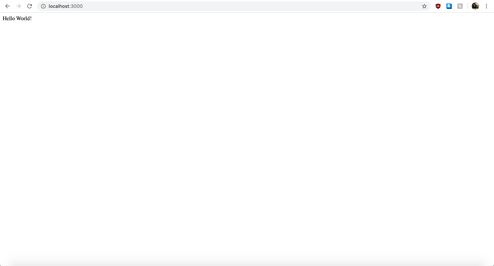

# Creating Your First Express Server

These instructions will go over how to setup a the most basic web server using Express.js and then introduce additional components to make your server more useful and scalable.

## Setting Up Your Server's Root Directory

Express.js is a framework for Node.js. If you do not have Node.js installed, please download it here at [nodejs.org](https://nodejs.org/en/download/).

#### 1. Create Your Root Directory

Once you have Node.js installed, create a new file directory for your server/project. You can do this with your explorer (Windows) or finder (MacOS), your favorite code editory, or with your terminal. We encourage that you get used to typing in comands with your terminal, and can do so with the following commands:


For now, we will simply create the server directly inside this root folder, so this will be the only file we need to create right now.

#### 2. Intialize npm

The next few steps will require the use of the terminal. In your terminal, type the command **npm init** and press enter like so:


Running npm init prompts various questions regarding your project. For now, you can skip these questions by pressing enter.

The npm init command, creates a file called package.json which at its core, is a configuration file for your project. We will not go over why you should be doing this in this tutorial. If you would like to look into this however, we encourage you to look into the official documdntation by [npmjs](https://docs.npmjs.com/creating-a-package-json-file).

#### 3. Installing Express.js

Now, we are ready to install our server software, Express.js. We can do this again, by typing a command into the terminal like so:


>Note: If you are also referencing older resources, they may be instructing you to also type the --save option after typing express. As of [npm 5.0.0](https://blog.npmjs.org/post/161081169345/v500), all installations are saved as a dependency in your package.json by default.

Finally, at this point, we are ready to create our first web server using Express.js.

## Hosting Our First Web Server with Express.js

Now that we have everything ready, we can create our first web server with just a few lines of code.

#### 1. Creating Our Server File and Requiring Express

If you aren't already aware, this may seem incredible, but all we need to do to create a web server is to create a simple JavaScript file! Express will do everything else to bring your server to life.

You can create your JavaScript file with your terminal or a code editor like [vscode](https://code.visualstudio.com/).

After your file is created, let's require/import the express library that we just downloaded with the following line of code:

```javascript
const express = require('express')
```

After we have required the express library, we can get access to all of its functions by creating an express() object by calling it and binding it to a variable like so:

```javascript
const app = express()
```

You can call your variable something else, but it is convention to name an express object as 'app'.

Putting the two lines together, your file should look like this:

```javascript
const express = require('express')
const app = express()
```

The express object has so very many functions and properties that we will not be able to go over even one tenth of them in this tutorial. If you are curious, however, we encourage you to look at [express.js' official documentation](https://expressjs.com/en/api.html).

For now, let's define a basic endpoint for our express application that simply returns the words *"Hello World"* to any client that accesses that endpoint.

#### 2. Creating Our First Express Endpoint

We can create a  by calling the .get() property on our express object. If you take a look at your code editor, you will notice that it the .get() property takes two arguments, a string that corresponds to a url path and a callback function that itself takes two arguments for request and response.

Let's pass in '/' which simply refers to the index page, and an anonymous function with two parameters:

```javascript
app.get('/', (req, res) => {
    
})
```

>Note: It is convention to use 'req' as the abbreviation for request and 'res' as the abbreviation for response. You can change them to any two words, but the first word will always refer to request and the second will always refer to response.

The body of the callback function will be called automatically every time a user accesses the index page endpoint. For now, we can simply test that the .get() property is working as intended by logging "hello world" to the console like this:

```javascript
app.get('/', (req, res) => {
    console.log("Hello World!")
})
```

And, at this point, our file should look like this:
```javascript
const express = require('express')
const app = express()

app.get('/', (req, res) => {
    console.log("Hello World!")
})
```

Now, if you try to run this code, it won't work just yet. This is because we still need to call one more express object property called .listen() to actually host the index page endpoint.

#### 3. Hosting Our First Endpoint

If you call the .listen() property, you will notice that it also takes one argument for a port number, and an optional callback function that is called after the application is hosted. For now, let's pass in the integer 3000 for the port number and an anonymous callback function that simply logs out a message like so:

```javascript
app.listen(3000, () => {
    console.log(`Express app hosted on port 3000!`)
})
```

Now, we can finally test our endpoint by typing node app.js into our terminal like so:

```bash
$ node app.js
```

And typing 'http://localhost:3000/' into our browser.

You will notice that your browser just hangs and doesn't display anything, but that's perfectly fine because all we have done is log out a pair of messages. Checking our console, we can see the following:

```javascript
'Express app hosted on port 3000!'
'Hello World!'
```

At this point, we have created our first end point, and hosted it to a port. Next, let's send a response back to our user.

#### 4. Sending an HTTP Response to the User

So far, our code should now look like this:

```javascript
const express = require('express')
const app = express()

app.get('/', (req, res) => {
    console.log("Hello World!")
})

app.listen(3000, () => {
    console.log(`Express app hosted on port 3000!`)
})
```

Now let's replace the console.log with a response to the user. We can do this by calling the .send() property on the response argument.

```javascript
app.get('/', (req, res) => {
    res.send()
})
```

If you are following along in your code editor, you can see that it is expecting something to be passed into a 'body'. This body refers to the response object's body, and is the code that will get rendered to the browser. For now, let's pass in "Hello World!" like so:

```javascript
app.get('/', (req, res) => {
    res.send("Hello World!")
})
```

Let's try re-running our server and accessing our local host again. Your browser should now render the following:



Congratulations! Now, we've setup a Express.js server and hosted our first end point. Next up is to do a bit of code refactoring to make our server more useful.

## Refactoring the Code to Increase Modularity

There are a few things that can be done to make the code more modular and easier to work with. Even if you are working alone, creating modular code will make your work easier to read and debug.

In this section, we will go over the following:
<ul>
<li>Removing Magic Numbers</li>
<li>Moving the Hosting Functionality to Another File</li>
<li>Moving Express Apps into Sub-Folders.</li>
</ul>

#### Removing Magic Numbers From Your Code

Our code so far is only eight lines, but even then, we have introduced a magic number. Our port number is bound directly to the number 3000 and our error message also references this number directly. Let's change that by binding the port number to a global variable for now, and then simply referencing that variable like so:

```javascript
const express = require('express')
const app = express()
const port = 3000

app.get('/', (req, res) => {
    console.log("Hello World!")
})

app.listen(port, () => {
    console.log(`Express app hosted on port ${port}!`)
})
```

There we go, much better. If your code depends on a constant, it should refer to a single variable. This is done so that we as developers don't have to change every single constant in a file to a new constant value. By convention, constants should be at the top of the file. 

We could even go one step further by importing constants in a file that contains all constants, but we will leave it like this for this tutorial.

#### Moving the Hosting Functionality to Another File

Another thing we can do to increase modularity is to wrap the app.js file in a function, export it and have the hosting function completed in another file. This has several benefits such as making your code easier to test and debug. It also follows the concept of increasing [dependency injection](https://en.wikipedia.org/wiki/Dependency_injection), which isn't something we will go over in this tutorial, but is something to read if you are so curious.

There are really only two things that need to be done for this section:
<ol>
<li>Wrap the app.js Code In a Function and Return It</li>
<li>Move the app.listen Function to Another File.</li>
</ol>

After doing these two things, your code should look something like this:
```javascript
file 1: app.js
--------------

module.exports = () {
    const express = require('express')
    const app = express()

    app.get('/', (req, res) => res.send('Hello World!'))

    return app
}()


file 2: server.js
-----------------

const port = 3000

app.listen(port, () => console.log(`Example app listening on port ${port}!`))

```

>Note: In order to run this Express app, we will need to type node server.js instead of node app.js, and that's because it is the server.js file that is doing the hosting now.

Again, this may seem very unnecessary at this point in your code, but simply imagine having an app.js that requires 30 or more applications and hosts many times more endpoints. Your code will get messy very quickly. Adding this one extra little step, will go a long ways to making your code more readable and easier to work with. 

Finally, let's move into our last topic, and the one that will take a bit more work to accompmlish - moving files into sub-folders.

#### Moving Express Apps into Sub-Folders

Now that we have covered the essentials for hosting and endpoint and sending a simple response to our users, we will be covering how to host some static content like an HTML file in a sub-folder within our root directly.

#### 1. Requiring a File From Your Sub-Folder

For this particular example, we will only be serving static content, so requiring a file is made a bit easier by the Express framework. However, the fact is, is that we still need to require the file from wherever we put it.

First off, let's create a folder named **public** directly within our root directory. In order to require a file, we will need to use another Express app property called app.use(). Then we can chain it with another Express property called express.static() to require our 'public' folder like so:

```javascript
app.use(express.static('public'))
```
>Note: By convention, people use the name **public** to host their static content like HTML and CSS files. 

It is important to understand that these two properties are their own parts and that app.use() specifically, can be used independent of express.static(). This is because, express.static is a special property used to host static content. If we were to switch it up and try to host dynamic content, we will also need to use app.use(), but then combine it with another way to require the dynamic file.

At this point, our code within app.js should look like this:
```javascript
app.js
------

module.exports = () {
    const express = require('express')
    const app = express()

    app.get('/', (req, res) => res.send('Hello World!'))
    app.use(express.static('public'))

    return app
}()
```

>Note: Our server.js file will still handle the hosting.

#### 2. Creating Some Static Content

Now that we have our app.js setup to host from our public folder, for this tutorial, let's create a basic HTML5 compliant page called index.html with the words 'Goodbye World!' in it like so:

```HTML
index.html
----------

<!DOCTYPE html>
<html lang="en">
<head>
    <meta charset="UTF-8">
    <meta name="viewport" content="width=device-width, initial-scale=1.0">
    <title>Hosting From Your Public Folder In Express</title>
</head>
<body>
    <h1>Goodbye World!</h1>
</body>
</html>
```

Keep in mind that naming a file index.html has a special property whereby typing the name of the url with nothing after it or just a slash refers to index.html. So we should be expecting to see Goodbye World! when we type localhost:3000 into our browser. Let's see what we get when we try this...


What a minute! Nothing has changed?!

It's time to discuss the importance of routing.

#### Hosting Your Apps and the Importance of Routing 

When we host our express apps, we need to be cognizant about the order of which we are hosting end points and where we are putting our files (ie. like in which sub-folders). This is because express will host the first endpoint that meets their criteria.

Let's explore this by examining our code again.
```javascript
app.js
------

module.exports = () {
    const express = require('express')
    const app = express()

    app.get('/', (req, res) => res.send('Hello World!'))
    app.use(express.static('public')) //hosting a file called index.html

    return app
}()
```

I mentioned that index.html has a special property whereby users trying to access the endpoint where nothing exists after the root url and/or with a slash after it will receive index.html. However, notice how our app.get('/') is already an endpoint that is listening for a slash.

In this case, the end user types in the url (which in this case is localhost:3000), express determines that the endpoint with just a slash matches the url requested, and serves the app.get('/') endpoint and thus serving 'Hello World!' **without ever getting to the next line** where it sends 'Goodbye World!'.

This is a prime example about why we need to be careful with our code, and in this case, careful about how we are routing our apps.

In order to see Goodbye World! we can do one of two things:
We can access localhost:3000/index.html directly, or we can comment out the app.get('/') endpoint and access localhost:3000 again. Let's do the latter right now like so:

```javascript
app.js
------

module.exports = () {
    const express = require('express')
    const app = express()

    //app.get('/', (req, res) => res.send('Hello World!'))
    app.use(express.static('public'))

    return app
}()
```

And now, accessing localhost:3000 in our browsers we can see the following:


Perfect. You have now learned how to host from a file from a sub-folder within the root directory of your project using Express.js.

## Conclusion

Congratulations! You have now learned the fundamentals for creating an Express server to host an end point and can even host files from a static folder. Next up will be to expand on the possibilities that Express has to offer by further exploring routing, hosting dynamic applications, and using middleware to expand on Express.js' functionalities.