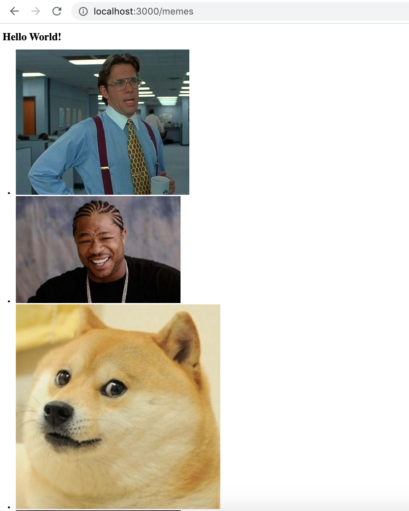

# Creating a Simple Application

Now that we have an express server skeleton setup, let's create a simple application to demonstrate how the express server will work.

For this example, we will create a javascript file that will simply call an API that will return an JSON object filled with an array of meme objects.

We will use the following API endpoint from api.imgflip.com:

    https://api.imgflip.com/get_memes

#### Step 1 - Setting up Dependencies

For this demo applicatiaon we will be using the request library.

Simply type 'npm install request' in your command line to install the library.

After that, we can import the library into the file with the following line of code:

```javascript
const request = require('request')

```

#### Step 2 - Creating a new getMemes() function

```javascript
function getMemes(){
    return New Promise ((resolve, reject) => {

    })
}
```

Here I have chosen to use Promise syntax, but you can change the function to use callbacks or async await instead.

Now let's define request inside our function and also the url of the API we will be calling like so:

```javascript
function getMemes(){
    return New Promise ((resolve, reject) => {
        const request = require('request')
        const url = 'https://api.imgflip.com/get_memes'
    })
}
```

#### Step 3 - Using the Request Library to request for the JSON data from imgflip

The request library has the following function for requesting the JSON data from an API:

```javascript
    //Note that this section of code will be inside of our getMemes() function
    request(url, (error, response, body) => {
        //if there is no error and the response from the API's server is status code 200
        if (!error && response.statusCode == 200) {
            //do something with the 'body' such as:
            console.log(body)
        }
    }

```

The request function has 2 parameters, a string for the url of the API, and a function that takes an error, the response object, and something the request library refers to as 'body'.

Let's see what is inside this mysterious 'body' parameter by logging it to the console...

```javascript
{"success":true,"data":{"memes":[{"id":"181913649","name":"Drake Hotline Bling","url":"https:\/\/i.imgflip.com\/30b1gx.jpg","width":1200,"height":1200,"box_count":2}, ...
```

If you are following along, you'll see that the a very large block of code gets printed to the console. I have only copied the first big of this block.

Why don't we refactor it a bit so that it is easier to read like so:

```javascript
{
"success":true,
"data":{
    "memes":
        [
            {"id":"181913649",
            "name":"Drake Hotline Bling",
            "url":"https:\/\/i.imgflip.com\/30b1gx.jpg","width":1200,
            "height":1200,
            "box_count":2},
            
            ...,

            ...,

        ]
    }
}
```

Essentially this API is returning an object with several properties, notably a data property that is housing our meme objects that are stored in an array. The reason why the 'body' is so long, because it stores so many meme objects.

#### Step 4 - Parsing Out the Data and Preparing it to be Sent Out

Now that we can see what we are getting when we call the request function, let's prepare it for our server.

We know that the object has a property called data that itself is an object with the property memes (which contains our meme objects), so we can simply use dot notation twice to access it like so:

```javascript
    let memes = (JSON.parse(body)).data.memes
```
Note that we need to parse the body out of the JSON object, and we can do that just by using JSON.parse().

Once we have our memes, we can simply loop through them and push them into a container like an array, like so:

```javascript
    let memes = (JSON.parse(body)).data.memes
    let cache = []

    memes.forEach((meme) => {
        cache.push(meme)
    })
```

Now let's log our new filled up array to the console and see what we have now.

```javascript
[ 
    { id: '181913649',
    name: 'Drake Hotline Bling',
    url: 'https://i.imgflip.com/30b1gx.jpg',
    width: 1200,
    height: 1200,
    box_count: 2 },

  { id: '112126428',
    name: 'Distracted Boyfriend',
    url: 'https://i.imgflip.com/1ur9b0.jpg',
    width: 1200,
    height: 800,
    box_count: 3 },

  { id: '87743020',
    name: 'Two Buttons',
    url: 'https://i.imgflip.com/1g8my4.jpg',
    width: 600,
    height: 908,
    box_count: 2 },

    ...,

    ...
}
```
Wow! There sure are a lot of them. For now let's just limit the memes to ten by using an if statement and then pass them to resolve like so:

```javascript
    let memes = (JSON.parse(body)).data.memes
    let counter = 0;
    let cache = [];

    memes.forEach((meme) => {
        if (counter < 10) {
            cache.push(meme)
            counter++;
        }
    })

    if (counter >= 10) {
        //handle the result after code is completed
        console.log("Done.")
        resolve(cache)
    }

```

Putting it all together, our function should look like this:

```javascript
function getMemes(){
    return new Promise ((resolve, reject) => {
        const request = require('request')
        const url = 'https://api.imgflip.com/get_memes'
            request(url, (error, response, body) => {
                if (!error && response.statusCode == 200) {
                    let memes = (JSON.parse(body)).data.memes
                    let counter = 0;
                    let cache = [];
        
                    memes.forEach((meme) => {
                        if (counter < 10) {
                            cache.push(meme)
                            counter++;
                        }
                    })
                    console.log(cache)
                    if (counter >= 10) {
                        //handle the result after code is completed
                        console.log("Done.")
                        resolve(cache)
                    }
                }
            }) 
        
        })
}

module.exports = {
    getMemes
}
```

#### Step 5: Checking Our Work

If you log the result out to the console now, you should see the same array filled with meme objects, except that we've limited the number of memes to ten.

If you are paying close attention, however, you will notice that it is the exact same memes in the exact same order! Now, this would be fine if there ten memes were the only ones that we wanted to show our end users, but that seems a little bit boring. Why don't we add a shuffling function to the code, before be put ten memes into the cache array with something like this:

```javascript
    function shuffleArray(array) {
        for (let i = array.length - 1; i > 0; i--) {
            let j = Math.floor(Math.random() * (i + 1));
            let temp = array[i];
            array[i] = array[j];
            array[j] = temp;
        }
        return array;
    }
```

All we will have to do, is include this function in the same file (or require it from another file if you would like to modularize the code), and then call it before our loop like so:

```javascript
    let memes = (JSON.parse(body)).data.memes

    //shuffle the memes
    memes = shuffleArray(memes); 
    
    let counter = 0;
    let cache = [];

    memes.forEach((meme) => {
        ...
```

And at last, our file should look something like this:

```javascript
function getMemes(){
    return new Promise ((resolve, reject) => {
        const request = require('request')
        const url = 'https://api.imgflip.com/get_memes'
            request(url, (error, response, body) => {
                if (!error && response.statusCode == 200) {
                    let memes = (JSON.parse(body)).data.memes
                    memes = shuffleArray(memes); 

                    let counter = 0;
                    let cache = [];
        
                    memes.forEach((meme) => {
                        if (counter < 10) {
                            cache.push(meme)
                            counter++;
                        }
                    })
                    console.log(cache)
                    if (counter >= 10) {
                        //handle the result after code is completed
                        console.log("Done.")
                        resolve(cache)
                    }
                }
            }) 
        
        })
}

function shuffleArray(array) {
    for (let i = array.length - 1; i > 0; i--) {
        let j = Math.floor(Math.random() * (i + 1));
        let temp = array[i];
        array[i] = array[j];
        array[j] = temp;
    }
    return array;
}

module.exports = {
    getMemes
}
```

Now that we have completed our application, let's wrap it up! (no pun intended).

#### Step 6: Importing Your Application and Wrapping It in the Express App 

In your app.js file or whatever you named your file that handles wrapping your applications, it is time to setup our first real end point.

So far our app.js file should look something like this:

```javascript
    module.exports = function (database) {
        const express = require('express')
        const app = express()

        app.set('view engine', 'ejs')
        
        app.get(('/'), (request, response) => {
            response.send('<h1>Hello World!</h1>')
        })
        
        return app;
    }(null);
```

First, let's start off by requiring our newly created memes file with:

```javascript
    const memes = require('./memes')
```

Now, let's make an endpoint called /memes. Like before, we will need to use the express app.get() function, and then pass in our endpoint name. We can simply call our function in memes.js and assign it to a variable and just log it out to the console for now like so:

```javascript
    app.get(('/memes'), (request, response) => {
        let result = memes.getMemes()
        console.log(result)
    })
```

Interesting, this will log out:

```javascript
    Promise { <pending> }
```

And that's not the thing that we want, so we will need to modify the code by adding some sort of mechanism to handle the fact that calling memes.getMemes() is an asynchoronous function. I will use async await syntax to achieve this, but again you could use callbacks or promises if you prefer.

Refactoring the code, we get this:

```javascript
    app.get(('/memes'), async (request, response) => {
        let result = await memes.getMemes()
        console.log(result)
        
    })
```

Much better.

#### Step 7: Rendering the Result to the /memes Endpoint

Now that we have our results in our express app, we just need to render it so the client can see it. To do this, we can simply use embedded JavaScript (EJS) like so:

```javascript
    let result = await memes.getMemes()

    response.render('memes', {
        title: 'Memes, Memes, Memes!',
        listOfMemes: result 
    })
```

Now that we have our application wrapped in an app.get() we can create a memes.ejs file to push render to. For now, let's just create a basic ejs file called memes.ejs in our views folder. This file doesn't have to contain anything other than HTML5's boiler plate code for now.

After that is done, we can call response.render() which takes the name of the ejs file (in thise case memes.ejs) and an object where we map our result to a variable that is passed to our ejs file for handling.

At this point, our app.js file should look like this:

```javascript
    module.exports = function (database) {
        const express = require('express')
        const memes = require('./memes')
        const app = express()

        app.set('view engine', 'ejs')
        
        app.get(('/'), (request, response) => {
            response.send('<h1>Hello World!</h1>')
        })

        app.get(('/memes'), async (request, response) => {
            let result = await memes.getMemes()

                response.render('memes', {
                title: 'Memes, Memes, Memes!',
                listOfMemes: result 
            })
        })
        
        return app;
    }(null);
```

#### Step 8: Handling the Memes in the EJS File

Once we have access to the result in the form of a variable called 'listOfMemes', we can simply loop through our array of meme objects and create HTML tags to be displayed. In this case, I have chosen to wrap the meme objects in a list tag.

```html
<!DOCTYPE html>
<html lang="en">
<head>
    <meta charset="UTF-8">
    <meta name="viewport" content="width=device-width, initial-scale=1.0">
    <title>Document</title>
</head>
<body>
    
    <h1>Hello World!</h1>
    <ul>
        <% listOfMemes.forEach(function(item, index){ %>
            <li> " alt="some meme" </li>
        <% }); %>
    </ul>

</body>
</html>
```

And at last, we can take a look at our finished product by starting up our node express server and then using our browser to access our localhost, in my case, this is http://localhost:3000/memes.

The page should look something like this:


It could certainly use a bit of styling, but we'll leave that for another time.

#### Step 9: Error Handling - The Optional but Not Really Part

So our memes endpoint/webpage works, but no code is complete without error handling. We can add some error handling by simply wrapping our function call to memes.getMemes() in a try-catch block like so:

```javascript
    app.get(('/memes'), async (request, response) => {
        try {
            let result = await memes.getMemes()

            response.render('memes', {
                title: 'Memes, Memes, Memes!',
                listOfMemes: result 
            })

        } catch (error) {
            //handle error here
            console.log(error)
        }
        
    })
```
and finally, our app.js file should look like this:

```javascript
module.exports = function (database) {
    const express = require('express')
    const memes = require('./memes')
    const app = express()

    app.set('view engine', 'ejs')

    app.get(('/memes'), async (request, response) => {
        try {
            let result = await memes.getMemes()

            response.render('memes', {
                title: 'Memes, Memes, Memes!',
                listOfMemes: result 
            })

        } catch (error) {
            console.log(error)
        }
        
    })
    
    return app;
}(null);
```

#### Summary

At this point, we have created a basic express server, created an application that is asynchronous, handled that asynchronicity within our app.get() function inside our express app, and successfully rendered the result to the end user.

Congratulations!!! You are now one step closer to becoming a web developer.

In the next section, we will be talking about integrating a method to handle our errors centrally.
